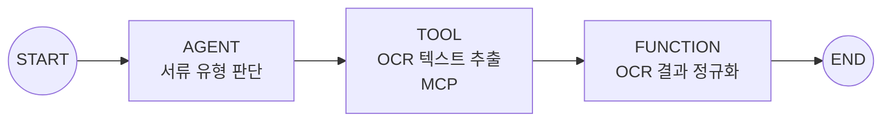
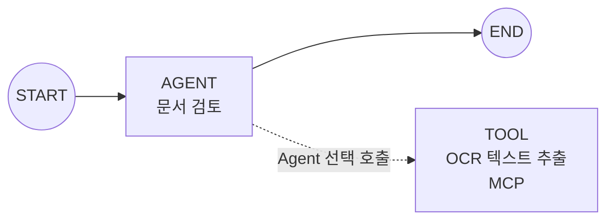
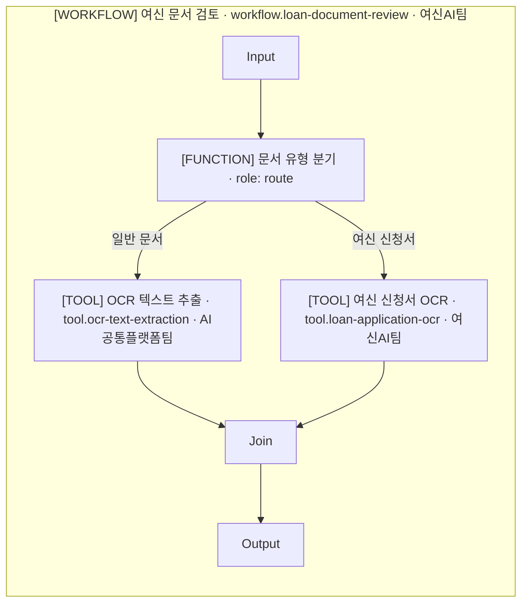

> 이 문서는 Target Contract다. 현재 구현과의 차이는 [docs/migration/taxonomy-vnext-status.md](../migration/taxonomy-vnext-status.md)가 기록한다.

# Agent Factory 그래프 중간 표현(Graph IR)

이 문서는 Workflow의 실행 구조를 표현하는 그래프 중간 표현(Graph IR)의 단일 기준이다. 재사용 자산의 종류와 업무·소유·재사용 속성은 [Taxonomy](taxonomy.md)가 정의한다.

## 카탈로그(Catalog) 자산과 그래프 노드(Graph Node)

Catalog 자산은 독립적으로 검토·버전 관리·재사용하는 계약이다. Graph Node는 특정 Workflow 실행에서 무엇을 실행하거나 기다리거나 합류할지를 표현한다. 두 계층은 참조 관계이며 경쟁하는 분류 체계가 아니다.

| Graph 표현 | 참조 또는 소유 대상 | 의미 |
| --- | --- | --- |
| Agent Node | Agent 자산 | 독립 판단 책임을 이번 Workflow에서 실행한다. |
| Tool Node | Tool 자산 | 검토된 Tool 계약을 Workflow의 명시적 단계로 호출한다. |
| Subworkflow Node | Workflow 자산 | 검토된 하위 Workflow의 입출력 계약을 호출한다. |
| Function Node | 부모 Workflow 내부 구현 | 해당 Workflow에만 속한 결정적 코드 단계를 실행한다. |
| Human Input Node | 사용자 입력 계약 | 입력·승인·선택을 기다리고 실행을 중단·재개한다. |
| Join Node | Graph 실행 제어 | 여러 upstream 결과의 fan-in과 동기화를 수행한다. |

Graph Node의 존재만으로 Catalog 자산이 생기지 않는다. `agent_ref`, `tool_ref`, `workflow_ref`가 있는 Node만 해당 자산 계약을 참조한다.

## 권장 Node 종류

| 표시명 | 직렬화 | 의미 |
| --- | --- | --- |
| Input/Start | `input` | Workflow 입력과 시작 경계 |
| Agent Node | `agent` | Agent 자산의 판단 책임 실행 |
| Tool Node | `tool` | Tool 자산의 명시적 호출 |
| Function Node | `function` | Workflow 내부 결정적 단계 |
| Human Input Node | `human_input` | 사용자 입력·승인·선택 대기 |
| Subworkflow Node | `subworkflow` | Workflow 자산 호출 |
| Join Node | `join` | fan-in과 동기화 |
| Output/End | `output` | Workflow 결과와 종료 경계 |

Router, Loop Controller, Callback, Resume, Retry는 자산 유형이 아니다. 우선 Function Node의 `role`, Edge의 조건·제어 의미, container와 execution semantics로 표현하고, 독립적인 실행 상태가 실제로 필요할 때만 제어 Node로 드러낸다.

Function Node의 권장 `role`은 `transform`, `validate`, `route`, `merge`, `prepare_input`, `format_output`이다. `role`은 가독성을 위한 속성이며 새 Taxonomy나 subtype이 아니다.

Current Implementation에는 dedicated control node인 `router`, `loop_control`, `callback_wait`, `join`이 있다. 이 값은 [Current Implementation 대응](#current-implementation-대응legacy)에서 보존하되 Catalog 자산으로 승격하지 않는다.

## Function Node

Function Node는 하나의 Workflow 내부에서 Graph가 해당 지점에 도달하면 실행되는 결정적 코드 단계다. Agent가 실행 여부를 판단하지 않으며, 부모 Workflow의 Domain과 Owner를 상속한다. 독립 Catalog 자산이 아니라 Workflow 전용 private method에 가깝다.

작은 helper를 모두 Node로 만들지 않는다. 아래 중 하나 이상이 있을 때만 Function Node로 승격한다.

1. 독립 입출력 경계가 있다.
2. 개별 실패·재시도 추적이 필요하다.
3. 분기 또는 Join의 기준점이다.
4. 중단·재개 체크포인트다.
5. 감사상 독립 단계로 남아야 한다.
6. 업무 설명에서 독립 단계로 표현할 의미가 있다.

예를 들어 OCR 응답의 필드를 다음 단계 계약으로 정규화하고 그 실패를 별도로 추적해야 한다면 `role: transform`인 Function Node가 될 수 있다. 단순 문자열 trim처럼 독립 경계가 없는 helper는 내부 코드로 남는다.

## Tool Node

Tool Node는 Catalog의 Tool 자산을 Workflow가 명시적 실행 단계로 호출하는 Graph Node다.

- `tool_ref`로 Tool 자산을 참조한다.
- 독립 입출력 계약, Owner, 버전, 권한, 감사 경계를 Tool 자산에서 유지한다.
- 여러 Workflow 또는 Agent가 같은 Tool 계약을 재사용할 수 있다.
- Tool 구현은 Function 또는 MCP로 연결될 수 있다.
- Node에는 이번 Graph의 실행 제어만 기록하고 Tool의 Binding과 Transport를 복제하지 않는다.

## Function Node, Tool Node, Function Tool 구분

> **핵심 구분:** Function Node는 Workflow 내부 단계이고, Tool Node는 독립 Tool 자산의 Graph 호출이다. **Function Tool은 Tool이다.** Function Node와 혼동하지 않는다.

같은 함수라도 사용 방식에 따라 다음과 같이 표현한다.

```text
같은 함수
├── Workflow Graph가 내부 단계로 직접 실행
│   └── Function Node
├── 독립 Tool 계약으로 등록한 뒤 Workflow가 명시적으로 호출
│   └── Tool Node + Function binding
└── Agent가 상황에 따라 사용 여부를 판단
    └── Agent–Tool capability 관계 + Function binding
```

| 구분 | Function Node | Tool Node | Agent–Tool capability |
| --- | --- | --- | --- |
| 독립 Catalog 자산 | 아니오 | Tool 자산 참조 | Tool 자산 참조 |
| 실행 결정 | Graph 도달 시 실행 | Workflow가 명시적으로 실행 | Agent가 상황에 따라 결정 |
| Owner | 부모 Workflow 상속 | Tool Owner 유지 | Tool Owner 유지 |
| 연결 정보 | 부모 Workflow 내부 구현 | Tool 자산의 Binding 참조 | Tool 자산의 Binding 참조 |

## Tool Invocation Control

호출 결정권(Invocation Control)은 Tool 사용 여부를 누가 정하는지 표현한다.

| 표시명 | 직렬화 | 의미 | Graph 표시 |
| --- | --- | --- | --- |
| Workflow | `workflow` | 명시적 Graph가 Tool 실행을 결정한다. | 실행 순서의 실선 Edge |
| Agent | `agent` | Agent가 런타임 상황에 따라 Tool 사용 여부를 결정한다. | available Tool 관계의 점선 또는 badge |

Target Contract의 활성 용어로 Model, LLM, `selected_by_llm`, `decision_owner: llm`을 호출 결정권에 사용하지 않는다. ADK 내부 구현에서 모델이 Tool 이름·설명·parameter schema를 바탕으로 Tool을 선택하더라도 사람 대상 개념은 Agent 판단이다. 모델은 Agent 내부 구현 요소다.

### 표준 도식 1: Workflow가 Tool을 명시 호출



실선은 Workflow가 명시적 control-flow에서 Tool 실행을 결정한다는 뜻이다. Tool Node로 이어지는 실선 Edge는 Invocation Control: Workflow다.

### 표준 도식 2: Agent가 Tool 사용 여부를 판단



점선은 Agent가 사용할 수 있는 Tool capability 관계를 뜻한다. 고정 실행 순서가 아니며, 런타임 상황에 따라 호출하지 않을 수 있다. 주 실행 흐름의 실선과 구분해 점선 또는 capability badge로 표시한다.

### Workflow 호출 직렬화 예시

```yaml
node_id: node-ocr-text-extraction
node_kind: tool
tool_ref: tool.ocr-text-extraction
invocation_control: workflow
```

### Agent 선택 직렬화 예시

```yaml
node_id: node-document-review-agent
node_kind: agent
agent_ref: agent.document-reviewer
available_tools:
  - tool_ref: tool.ocr-text-extraction
    invocation_control: agent
```

## 바인딩(Binding)과 전송(Transport)

Binding은 Tool을 어떤 방식으로 연결하는지, Transport는 실제 실행 경로가 무엇인지 나타낸다. Tool 자산이 Binding과 Transport의 단일 기준(source of truth)이다.

```yaml
asset_id: tool.ocr-text-extraction
asset_type: tool
binding:
  kind: mcp
  server_ref: mcp.ocr-service
  tool_name: extract_text
connection:
  transport: http
```

`binding.kind`는 `function`, `mcp`, `built_in`, `unresolved` 중 하나이고 `connection.transport`는 `in_process`, `stdio`, `http`, `unknown` 중 하나다. Backend/Dependency는 별도 의존성으로 기록한다.

Tool Node는 `tool_ref`로 이 계약을 읽는다. 같은 `binding`, `server_ref`, `tool_name`, `connection`을 Node마다 반복 저장하지 않는다. 화면이나 Mermaid에서는 참조 결과를 다음처럼 badge로 요약할 수 있다.

```text
[TOOL] OCR 텍스트 추출 / MCP · HTTP
```

## Subworkflow Node

Subworkflow Node는 다른 Workflow 자산을 호출한다. `workflow_ref`와 검토된 input/output 계약을 가지며, 부모 Workflow와 하위 Workflow 사이의 mapping과 실패 경계를 명시한다. 하위 Workflow의 내부 Node를 부모 Graph에 복제하지 않는다.

```yaml
node_id: node-fraud-review
node_kind: subworkflow
workflow_ref: workflow.fraud-review
input_contract_ref: schema.fraud-review-input
output_contract_ref: schema.fraud-review-output
```

## Human Input Node

Human Input Node는 사람의 입력·승인·선택을 기다리는 사용자 입력 계약이다. 질문 또는 안내, 함께 제시할 payload, 허용 응답 형식을 검토할 수 있어야 한다. 실행은 이 지점에서 중단되고 응답이 도착한 뒤 같은 Workflow 문맥으로 재개된다. ADK Graph의 `RequestInput`도 입력 요청 시 실행을 pause하고 사용자 응답 뒤 흐름을 이어 가는 계약으로 설명된다([Human input](https://adk.dev/graphs/human-input/index.md)).

사람이 선택한다는 사실은 Tool Invocation Control의 세 번째 값이 아니다. Human Input Node와 후속 Edge 조건이 사용자 선택을 표현하고, Tool 실행은 재개된 Workflow Graph가 명시적으로 결정한다.

## Join Node

Join Node는 둘 이상의 upstream 실행이 내보낸 결과를 기다리는 fan-in·동기화 지점이다. 독립 업무 자산이나 merge Tool이 아니며, 필요한 입력이 모두 도착하는 조건과 누락·실패 시 실행 의미가 Graph 계약에 드러나야 한다.

ADK 공식 Graph 문서의 `JoinNode`도 모든 upstream Event output을 기다린 뒤 결과 모음을 다음 Node로 전달한다고 설명한다([Graph workflows](https://adk.dev/graphs/index.md)).

## Route, Loop, Callback 표현 원칙

| 제어 의미 | Target 표현 원칙 |
| --- | --- |
| Route | Function Node의 `role: route`와 조건부 Edge를 우선 사용한다. 독립 상태가 필요하면 제어 Node를 사용할 수 있다. |
| Loop | loop container 또는 execution semantics와 back/exit Edge로 반복 영역과 종료 조건을 표현한다. |
| Callback wait | 외부 event 대기와 재개 지점을 execution semantics 또는 필요한 제어 Node로 표현한다. |
| Resume | 중단된 실행이 어떤 입력·event로 어느 지점에서 이어지는지 제어 의미로 표현한다. |
| Retry | 대상 실행의 실패 정책과 재시도 Edge/semantics로 표현한다. |

Router, Loop Controller, Callback, Resume, Retry를 Agent/Workflow/Tool 자산으로 등록하지 않는다. 현재 구현의 `route_condition`, `route_aliases`, `loop_region` 같은 이름은 Target 필드로 선언하지 않고 [Current Implementation](#current-implementation-대응legacy)에서만 설명한다.

## A2A 경계

A2A 경계는 Agent Node와 protocol boundary badge 또는 Edge의 조합으로 표현한다. Agent Node는 Agent 자산을 참조하고, 경계 표시는 호출이 A2A 계약을 건넌다는 사실만 나타낸다.

```text
[AGENT] 외부 문서 검토 / A2A · HTTP
```

A2A 계약은 Agent Card, lifecycle, auth, timeout, audit 같은 원격 경계 정보를 소유한다. A2A Agent를 Tool Node로 표현하거나 A2A Edge를 MCP Binding과 혼합하지 않는다. Workflow의 A2A 노출은 2026-07-18 확인 범위에서 직접적인 ADK 공식 근거가 발견되지 않았으므로 일반화하지 않는다.

## OCR 예시 Graph

아래 Graph는 [Taxonomy의 OCR 자산 예시](taxonomy.md#ocr-자산-예시)와 같은 자산 ID와 Owner를 사용한다. `workflow.loan-document-review`가 문서 종류에 따라 일반 OCR Tool 또는 여신 전용 OCR Tool을 명시적으로 호출하고 결과를 합류한다. 두 Tool 호출 Edge는 모두 Invocation Control: Workflow인 실선이다.



Function Node `R`은 Workflow 내부 단계이므로 여신 Workflow의 Domain과 Owner를 상속한다. Tool Node `G`와 `L`은 각각 참조 Tool 자산의 Domain과 Owner를 유지한다.

## Current Implementation 대응(`legacy`)

현재 코드와 스키마는 아래 `legacy` Graph vocabulary를 직렬화한다. 이 절은 현행 artifact와 skills가 참조하던 직렬화 계약의 활성 해석 지점이다. Target Graph IR이 이미 구현되었다는 뜻은 아니며, 상세 gap은 [Migration Status](../migration/taxonomy-vnext-status.md)가 기록한다.

### `node_kind` 대응

| 현재 `legacy` `node_kind` | Target 해석 | 비고 |
| --- | --- | --- |
| `input` | Input/Start | Target 의미와 직접 대응한다. |
| `output` | Output/End | Target 의미와 직접 대응한다. |
| `agent` | Agent Node | Agent 자산 참조 여부와 판단 책임을 함께 확인한다. |
| `function` | Function Node | 부모 Workflow 내부 단계인지 승격 기준으로 확인한다. |
| `tool` | Tool Node | Target `tool_ref`와 Invocation Control은 별도 확인이 필요하다. |
| `adapter` | 문맥에 따라 Tool Node 또는 비자산 경계 | `legacy` 호환 값이며 참조 대상이 Tool, Resource, Dependency 중 무엇인지 재판별한다. |
| `adapter_call` | Tool Node | Workflow의 명시 호출이면 Invocation Control: Workflow로 해석한다. |
| `human_input` | Human Input Node | 입력 계약과 중단·재개 의미를 확인한다. |
| `callback_wait` | callback 대기 제어 Node/semantics | Catalog 자산이 아니다. |
| `workflow` | 문맥에 따라 Subworkflow Node 또는 `legacy` 호환 표현 | 실제 Workflow 자산 호출인지 확인한다. |
| `workflow_call` | Subworkflow Node | `workflow_ref`와 input/output 계약으로 해석한다. |
| `remote_a2a` | Agent Node + A2A boundary 또는 `legacy` 호환 표현 | A2A는 자산 유형이 아니다. |
| `remote_agent_call` | Agent Node + A2A boundary | 독립 Agent와 A2A 계약을 함께 확인한다. |
| `join` | Join Node | fan-in과 동기화 제어다. |
| `router` | Function Node `role: route` 또는 필요한 제어 Node | Catalog 자산이 아니다. |
| `loop_control` | loop 제어 Node/semantics | container와 loop back/exit 의미를 함께 읽는다. |

### `edge_kind` 대응

현재 구현은 열 가지 `edge_kind`를 사용한다. 데이터 채널과 실행 제어를 한 enum에 함께 둔 `legacy` 계약이므로 Target에서는 의미 축을 분리해 읽는다.

| 현재 `legacy` `edge_kind` | Target 해석 |
| --- | --- |
| `event_output` | Node의 구조화 output 전달 |
| `event_message` | 사용자 대상 message 또는 입력 prompt 전달 |
| `session_state` | session 범위 state channel |
| `temp_state` | 임시 state channel |
| `user_state` | user 범위 state channel |
| `app_state` | application 범위 state channel |
| `artifact` | artifact 전달; 현행 필수 `artifact_key` 계약 유지 |
| `route` | 조건부 실행 Edge; 현행 `route_condition` 계약 유지 |
| `control` | loop, retry, cancel, timeout, resume 등 제어 의미 |
| `remote_a2a` | Agent 호출의 A2A protocol boundary crossing |

### `container_kind` 대응

| 현재 `legacy` `container_kind` | Target 해석 |
| --- | --- |
| `graph_workflow` | `workflow_profile.representation: graph`인 Graph의 root/region |
| `dynamic_workflow` | `workflow_profile.representation: dynamic`의 실행 영역 |
| `parallel_region` | fan-out/fan-in 병렬 execution region |
| `loop_region` | 반복 container/execution semantics |
| `human_review_region` | Human Input Node를 포함하는 검토 영역 |
| `remote_boundary` | Agent A2A protocol boundary 영역 |

### 호출 관련 enum 대응

현재 구현의 `invoke_binding`, `call_control`, `decision_owner`는 Binding, Invocation Control, 인간 입력, runtime 제어를 겹쳐 표현한다. Target에서는 각 값을 다음 의미로 읽는다.

| 현재 `legacy` 필드·값 | Target 해석 |
| --- | --- |
| `invoke_binding: unresolved` | Binding 미결 + `needs_info` |
| `invoke_binding: local_python` | 내부 구현 또는 Function binding 후보 + `in_process` Transport |
| `invoke_binding: direct_api` | Tool 후보 + External Interface/Dependency; Binding은 별도 판별 |
| `invoke_binding: mcp_tool` | Tool 자산 + `binding.kind: mcp` |
| `invoke_binding: mcp_toolset` | Agent의 available MCP Tool 관계 |
| `invoke_binding: local_function` | Function Node 또는 Tool 자산 + `binding.kind: function`으로 재판별 |
| `invoke_binding: internal_workflow` | Subworkflow Node + Workflow 자산 참조 |
| `invoke_binding: ui_input` | Human Input Node |
| `invoke_binding: remote_a2a` | Agent Node + A2A boundary |
| `invoke_binding: callback_wait` | callback 대기·재개 execution semantics |
| `invoke_binding: unknown` | Binding 미결 + `needs_info` |
| `call_control: none` | Tool Invocation Control이 없거나 비Tool Node |
| `call_control: fixed_by_workflow` | Invocation Control: Workflow(`workflow`) |
| `call_control: selected_by_llm` | Invocation Control: Agent(`agent`) |
| `call_control: selected_by_human` | Human Input Node와 후속 Workflow 제어로 재판별 |
| `call_control: event_callback` | callback event 제어 의미 |
| `call_control: resume` | 중단 후 resume 제어 의미 |
| `call_control: unknown` | 제어 의미 미결 + `needs_info` |
| `decision_owner: workflow_code` | Invocation Control: Workflow(`workflow`) |
| `decision_owner: llm` | Invocation Control: Agent(`agent`) |
| `decision_owner: human` | Human Input Node와 후속 Workflow 제어로 재판별 |
| `decision_owner: remote_agent` | 원격 Agent 내부 판단 또는 A2A 응답 계약 |
| `decision_owner: system` | runtime/system execution semantics |
| `decision_owner: unknown` | 결정 책임 미결 + `needs_info` |

`fixed_by_workflow`는 Target의 Workflow 명시 호출로, `selected_by_llm`은 Target의 Agent 판단으로 해석한다. `mcp_tool`은 Tool과 MCP Binding의 조합이고, `mcp_toolset`은 Agent가 사용할 수 있는 MCP Tool 관계다. 이 `legacy` literal은 Target 문서의 활성 직렬화 값으로 사용하지 않는다.

### Current Implementation 직렬화 계약(`legacy`)

아래 규칙은 현행 artifact를 읽고 검증할 때 필요한 로드베어링 계약이다.

- 최종 edge ID는 `edge-001` 형식, container ID는 `container-root`, `container-human-review` 형식의 canonical ID를 사용한다. `e-001`, `c-root` 같은 축약형은 최종 artifact 계약이 아니다.
- Synthetic node인 `input`, `output`, `join`, `router`, `loop_control`은 `module_id: null`이어야 한다.
- `edge_kind: route`에는 `route_condition`이 필요하다. 현행 `route_aliases`와 `is_default_route`는 route 선택 보조 계약이다.
- `edge_kind: artifact`에는 `artifact_key`가 필요하다.
- `edge_kind: remote_a2a`에는 `is_remote_boundary_crossing: true`와 `a2a_contract_id`가 필요하다.
- 현행 Graph IR export에는 legacy stage-flow key인 `type`, `subtype`, `edge_type`, `data`, `data_channel`을 포함할 수 없다.

이 소절은 현행 직렬화 계약의 요점만 보존한다. Target Node 이름과 필드는 이 계약에 맞춰 이미 동작한다고 간주하지 않는다.
