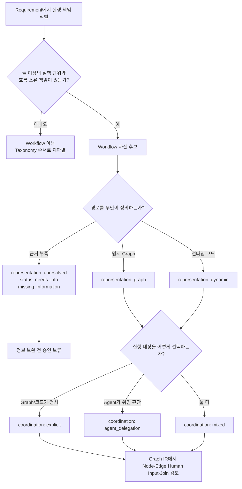

# Workflow 판단 가이드

이 문서는 requirement에서 Workflow 자산 경계를 식별하고 representation과 coordination을 분리해 검토하는 절차를 설명한다. Workflow 정의와 `workflow_profile`은 [Taxonomy](./taxonomy.md#workflow-profile), Node·Edge와 실행 제어는 [Graph IR](./graph-ir.md)를 단일 기준으로 사용하며 여기서 새 subtype을 정의하지 않는다.

## Target Contract

Workflow 판단은 다음 세 질문을 서로 다른 축으로 다룬다.

1. 둘 이상의 실행 단위와 흐름 소유 책임이 있어 Workflow 자산이 필요한가?
2. 흐름을 명시 Graph와 런타임 코드 중 무엇이 정의하는가?
3. 실행 대상을 명시적 흐름과 Agent 위임 중 무엇이 선택하는가?

한 질문의 답을 다른 질문의 값으로 대신하지 않는다. 예를 들어 명시 Graph 안에서도 Agent가 다른 Agent로 위임할 수 있고, dynamic Workflow도 코드에서 실행 대상을 명시할 수 있다.

## 1. Workflow 자산 여부

다음 조건을 모두 확인한다.

- Agent, Tool, Subworkflow 또는 독립적으로 드러낼 내부 단계 등 둘 이상의 실행 단위가 있다.
- 순서, 분기, 병렬, 반복, 사람 입력 대기, 중단·재개, 합류, 종료 조건 중 하나 이상을 소유한다.
- 그 흐름의 입출력, 실패, 상태, 감사 경계를 독립 계약으로 검토할 책임이 있다.

실행 단위가 여러 개 보인다는 사실만으로 충분하지 않다. 한 Agent가 상황에 따라 여러 Tool을 사용하는 내부 판단만 있고 별도 흐름 소유 책임이 없다면 Agent와 available Tool 관계로 남을 수 있다. 반대로 대출 서류 접수, OCR, 판단, 보완 입력, 결과 합류의 순서와 종료 조건을 소유한다면 대출 서류 검토 Workflow 후보다.

Workflow 자산이 아니라면 [분석 가이드의 후보 탐색 순서](./analysis-guide.md#후보-탐색-순서)로 돌아가 Agent, Tool, Resource/Dependency 또는 Function Node 문맥을 다시 판별한다.

## 2. Representation

Representation은 Workflow 경로를 무엇이 정의하는지 답한다.

| Target 값 | 판별 질문 | 사용 조건 |
| --- | --- | --- |
| `graph` | Node와 Edge가 순서·분기·병렬·반복·대기·합류를 명시하는가? | 검토자가 Graph만으로 주요 경로와 종료 조건을 확인할 수 있다. |
| `dynamic` | 런타임 코드가 입력·상태에 따라 호출 수, 순서, 반복, 재귀 또는 다음 경로를 결정하는가? | 경로 결정 자체가 코드의 실행 책임이며 정적 Graph로 핵심 의미를 충분히 고정할 수 없다. |
| `unresolved` | Graph인지 dynamic인지 판단할 근거가 부족한가? | `status: needs_info`와 `missing_information`을 함께 기록하고 승인 전에 정보를 보완한다. |

`graph`가 단순하고 `dynamic`이 고급이라는 서열은 없다. Requirement가 보여 주는 경로 결정 책임에 맞는 표현을 선택한다. 분기나 반복이 있다는 이유만으로 자동으로 `dynamic`이 되지 않으며, 명시된 Edge와 종료 조건으로 검토할 수 있으면 `graph`로 표현할 수 있다.

## 3. Coordination

Coordination은 실행할 Agent 또는 실행 단위를 누가 선택하는지 답한다.

| Target 값 | 의미 | 판별 신호 |
| --- | --- | --- |
| `explicit` | Graph 또는 코드가 호출 대상을 명시한다. | 특정 Agent·Tool·Subworkflow를 Edge나 코드 경로가 직접 선택한다. |
| `agent_delegation` | Agent가 상황을 해석해 다른 Agent로 위임할지 판단한다. | 위임 대상 선택이 Agent의 판단 책임에 속한다. |
| `mixed` | 명시적 조정과 Agent 위임을 함께 사용한다. | 일부 경로는 Graph·코드가 고정하고 일부는 Agent가 위임한다. |

Coordination은 Tool Invocation Control을 대체하지 않는다. Tool 사용 여부는 [Graph IR의 Invocation Control](./graph-ir.md#tool-invocation-control)에 따라 Workflow 또는 Agent로 별도 기록한다.

## 4. ADK 구성법을 읽는 방법

2026-07-18에 확인한 ADK 공식 문서는 Workflow 구성법을 graph-based, dynamic, collaborative, template 네 관점으로 설명한다. 이 네 항목은 상호 배타적인 단일 분류축이 아니므로 Agent Factory의 Workflow subtype으로 옮기지 않는다. 근거는 [ADK Workflows](https://adk.dev/workflows/index.md)와 [ADK Graphs](https://adk.dev/graphs/index.md)에서 확인한다.

| ADK 설명 관점 | Target에서 읽는 위치 |
| --- | --- |
| graph-based | `workflow_profile.representation: graph` 판단 근거 |
| dynamic | `workflow_profile.representation: dynamic` 판단 근거 |
| collaborative | Agent 위임이 있는지 보는 coordination 관점 |
| template | subtype이 아닌 `workflow_profile.template_ref` 구현 패턴 참조 |

ADK 버전이나 프레임워크 구성법은 Workflow 자산의 본질을 바꾸지 않는다. 버전 확인 원칙은 [Taxonomy의 ADK 확인 기준](./taxonomy.md#adk-확인-기준)을 따른다.

## 5. Agent Node와 Agent 자산

Agent Node는 Workflow Graph에서 Agent 자산의 판단 책임을 실행하는 참조다. Agent 자산은 독립 책임, 입출력 계약, Owner, 버전과 검토 경계를 소유하고, Agent Node는 특정 Workflow 실행에서 그 자산을 어디에 배치하는지 표현한다.

따라서 Agent Node 하나를 추가했다고 새 Agent 자산이 자동으로 생기지 않으며, 같은 Agent 자산을 여러 Workflow나 여러 실행 위치에서 참조할 수 있다. Node의 Graph 역할을 `Root`, `Coordinator`, `Worker` 같은 새 Agent 자산 유형으로 승격하지 않는다.

## 6. Function Node와 Tool Node

상세 기준은 [Graph IR의 Function Node, Tool Node, Function Tool 구분](./graph-ir.md#function-node-tool-node-function-tool-구분)을 따른다.

| 질문 | Function Node | Tool Node |
| --- | --- | --- |
| 무엇을 가리키는가? | 부모 Workflow 내부의 결정적 private 단계 | 독립 Tool 자산 |
| 누가 실행을 결정하는가? | Graph가 해당 지점에 도달하면 실행 | Workflow가 명시적으로 호출 |
| Catalog 자산인가? | 아니다 | Tool 자산을 참조한다 |
| Owner와 계약은 어디에 있는가? | 부모 Workflow 맥락을 상속한다 | Tool의 독립 Owner·입출력·버전·권한 계약을 유지한다 |
| 대표 예 | OCR 결과 정규화 | 고객정보 조회, OCR 텍스트 추출 |

Function binding으로 구현된 Tool도 Tool 자산이다. 내부 함수라는 이유로 Function Node가 되는 것이 아니며, 같은 함수라도 독립 Tool 계약을 참조해 Workflow가 호출하면 Tool Node로 표현한다.

## 7. Subworkflow

Subworkflow Node는 다른 Workflow 자산을 호출하는 실행 참조다. 부모 Workflow는 하위 Workflow의 `workflow_ref`, 검토된 입출력 계약, mapping, 실패 경계를 사용하며 하위 Workflow 내부 Node를 부모 Graph의 새 자산처럼 복제하지 않는다.

하위 흐름이 단순히 보기 좋은 묶음이라는 이유만으로 Workflow 자산이 되지는 않는다. 별도 흐름 소유 책임과 독립 계약이 확인될 때만 Workflow 자산으로 검토하고, 그 자산을 호출하는 위치를 Subworkflow Node로 표현한다.

## 8. 반복·분기·Join

반복, 분기, 병렬, Join은 Workflow subtype이 아니라 Graph IR 표현이다.

- 분기는 조건부 Edge와 필요한 route 의미로 표현한다.
- 반복은 loop 영역, back/exit Edge, 종료 조건 같은 execution semantics로 표현한다.
- Join은 둘 이상의 upstream 결과를 기다리는 fan-in·동기화 지점으로 표현한다.

이 요소가 있다는 이유로 `orchestration`, `loop`, `parallel` 같은 Workflow subtype을 만들지 않는다. Target 표현의 자세한 규칙은 [Graph IR의 Route, Loop, Callback 표현 원칙](./graph-ir.md#route-loop-callback-표현-원칙)을 따른다.

## 9. Human Input

Human Input Node는 승인, 보완 정보, 선택 같은 사람 입력을 기다리는 계약이다. 질문·안내, 제시 payload, 허용 응답 형식, 중단 지점, 같은 Workflow 문맥으로 재개되는 조건을 검토한다.

사람의 선택은 Tool Invocation Control의 세 번째 값이 아니다. Human Input Node가 입력 대기를 표현하고 후속 Graph Edge 또는 코드 경로가 다음 실행을 결정한다. 자세한 의미는 [Graph IR의 Human Input Node](./graph-ir.md#human-input-node)를 따른다.

## 10. `orchestration` 처리 원칙

`orchestration`을 Workflow subtype으로 유지하지 않는다. 이 말은 여러 실행 단위를 조율하는 책임을 설명하거나 검색용 tag로 사용할 수 있을 뿐이다.

Requirement가 “orchestration workflow”라고만 말하면 representation을 추정하지 않는다. 실제 경로를 Graph가 정의하는지 코드가 정의하는지 확인하고, 조정 대상이 명시되는지 Agent가 위임을 판단하는지 별도 evidence로 기록한다. 근거가 없으면 `representation: unresolved`, `status: needs_info`, `missing_information`으로 남긴다.

## 판단 flowchart

## Current Implementation(`legacy`)

현재 schema와 분석 pipeline은 Target `workflow_profile`을 직렬화하지 않는다. 대신 legacy `workflow_kind` 값인 legacy `orchestration`, legacy `graph`, legacy `dynamic`, legacy `unknown`을 사용한다. 다음 표는 현행 artifact를 Target 관점에서 읽기 위한 해석이며, Target Contract가 구현되었다는 뜻이 아니다.

| Current Implementation(`legacy`) | Target 해석 | 검토 주의 |
| --- | --- | --- |
| legacy `workflow_kind: orchestration` | subtype으로 계승하지 않고 조율 책임 설명으로 분해한다. coordination은 `explicit`, `agent_delegation`, `mixed` 중 evidence에 맞게 별도 판별한다. | representation은 `graph`, `dynamic`, `unresolved` 중에서 다시 확인한다. |
| legacy `workflow_kind: graph` | `workflow_profile.representation: graph` 후보 | coordination과 `template_ref`는 별도 축이다. |
| legacy `workflow_kind: dynamic` | `workflow_profile.representation: dynamic` 후보 | coordination과 `template_ref`는 별도 축이다. |
| legacy `workflow_kind: unknown` | `workflow_profile.representation: unresolved` + `status: needs_info` + `missing_information` | `unknown`을 정상 subtype으로 유지하지 않는다. |

현재 Graph artifact의 legacy Node·Edge·control 값은 [Graph IR의 Current Implementation 대응](./graph-ir.md#current-implementation-대응legacy)에서 해석한다. legacy Workflow 분류의 영향 영역, 위험, 후속 필요 여부는 [Taxonomy vNext Migration Status](../migration/taxonomy-vnext-status.md)에서 확인한다.
